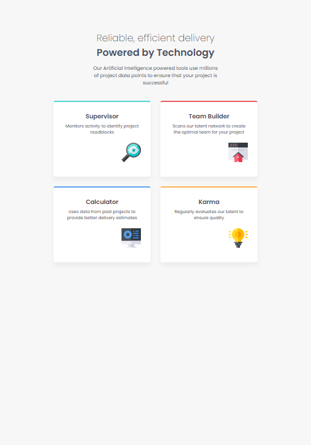

# Frontend Mentor - Four Card Feature Section Solution

This is my solution to the [Four Card Feature Section challenge](https://www.frontendmentor.io/challenges/four-card-feature-section-weK1eFYK) on Frontend Mentor. This challenge helped me practice layout techniques using both Flexbox and CSS Grid.

## Table of Contents

- [Overview](#overview)
  - [The Challenge](#the-challenge)
  - [Screenshots](#screenshots)
  - [Links](#links)
- [My Process](#my-process)
  - [Built With](#built-with)
  - [What I Learned](#what-i-learned)
  - [Useful Resources](#useful-resources)
- [Author](#author)
- [Acknowledgments](#acknowledgments)

## Overview

### The Challenge

Users should be able to:

- View the layout on **desktop (≥1025px)**, **tablet (769–1024px)**, and **mobile (≤768px)** screen sizes
- See subtle hover states on each feature card

### Screenshots

| Desktop | Tablet | Mobile |
|------------|-----------|-----------|
|  |  |  |


### Links

- **Solution URL:** [https://github.com/aawaizazhar/fm-four-card-feature-section/blob/main/README.md](https://github.com/aawaizazhar/fm-four-card-feature-section/blob/main/README.md)
- **Live Site URL:** [https://four-card-feature-section.vercel.app](https://four-card-feature-section.vercel.app)

## My Process

### Built With

- Semantic **HTML5**
- **CSS custom properties**
- **Flexbox** and **CSS Grid**
- **Mobile-first** & responsive workflow
- [Google Fonts - Poppins](https://fonts.google.com/specimen/Poppins)

### What I Learned

This project helped me improve my understanding of:

- Combining Grid and Flexbox for responsive layouts
- Creating dedicated **tablet breakpoints** (769–1024px)
- Adjusting spacing and alignment based on screen width
- Elevating card components using subtle box-shadows and transforms

```css
/* Tablet breakpoint */
@media (max-width: 1024px) and (min-width: 769px) {
  .cards {
    grid-template-columns: 1fr 1fr;
  }
}
```

### Useful Resources

- [CSS Grid Garden](https://cssgridgarden.com/) - Interactive game to learn CSS Grid
- [Flexbox Froggy](https://flexboxfroggy.com/) - Fun way to learn CSS Flexbox
- [MDN Web Docs - Grid](https://developer.mozilla.org/en-US/docs/Web/CSS/CSS_Grid_Layout) - Comprehensive guide to CSS Grid
- [CSS-Tricks: A Complete Guide to Grid](https://css-tricks.com/snippets/css/complete-guide-grid/) - Detailed reference for CSS Grid
- [Google Fonts](https://fonts.google.com/) - For the Poppins font family

## Author

- **Awaiz Azhar** – [@aawaizazhar](https://github.com/aawaizazhar)  
- Frontend Mentor – [@aawaizazhar](https://www.frontendmentor.io/profile/aawaizazhar)

## Acknowledgments

- [Frontend Mentor](https://www.frontendmentor.io) for providing this challenge
- The amazing community of Frontend Mentor for their support and feedback
- Special thanks to all the developers who share their knowledge through blogs and tutorials
- [MDN Web Docs](https://developer.mozilla.org/) for being an invaluable resource
- [CSS-Tricks](https://css-tricks.com/) for their excellent articles and guides
